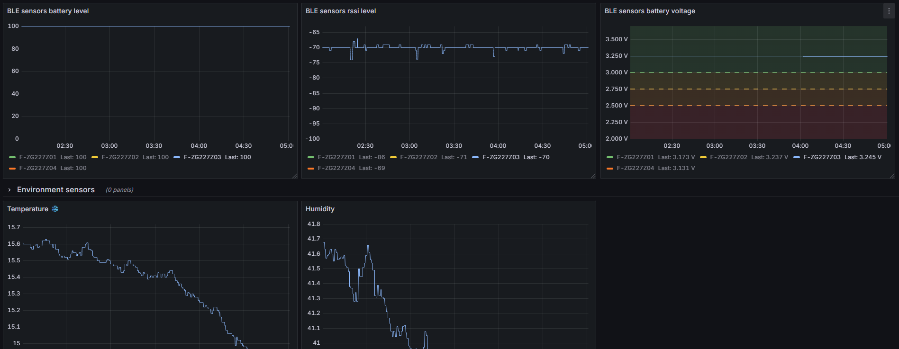
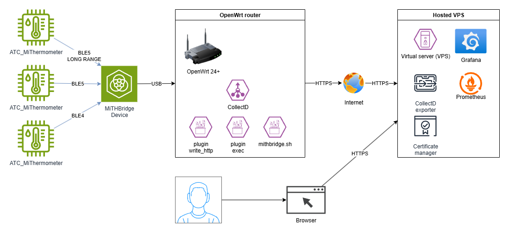

# MiTHBridge

**MiTHBridge** is a tiny device that listens for [pvvx/ATC_MiThermometer](https://github.com/pvvx/ATC_MiThermometer) BLE advertisements in **pvvx (custom)** format and prints data to USB-ACM serial in [CollectD exec plugin](https://collectd.org/documentation/manpages/collectd-exec.html) format. 

## Use case

### Short:
Connect MiTHBridge to your OpenWrt router, make some setup and monitor all [pvvx/ATC_MiThermometer](https://github.com/pvvx/ATC_MiThermometer) sensors within some range around MiTHBridge in Grafana.

### Long:
You can connect it via USB cable to your [OpenWrt](https://openwrt.org/) router, use [CollectD](https://collectd.org) with [CollectD exec plugin](https://collectd.org/documentation/manpages/collectd-exec.html) and [ash-shell script](doc/collectd_openwert_esp32c6.md) to put information into [CollectD](https://collectd.org), then with [CollectD write_http plugin](https://collectd.org/documentation/manpages/collectd.conf.html) write it to your monitoring server where [Prometheus CollectD exporter](https://github.com/prometheus/collectd_exporter) will consume metrics and export them to [Prometheus](https://prometheus.io/) database, after that you can monitor them with tool like [Grafana](https://grafana.com/)

## Hardware

**External antenna strongly recommended**. I tried using with ESP32-C3 SuperMini board, but it's ceramic antenna gives very low range of reception. XIAO ESP32-C6 with $2 external antenna gives much better range results.

### XIAO ESP32-C6

I recomend using [SEED STUDIO XIAO ESP32-C6](https://www.seeedstudio.com/Seeed-Studio-XIAO-ESP32C6-p-5884.html) board, as It is very tiny and It has a connector for connecting an external antenna for better reception. You will also want U.FL to SMA-F cable and 2.4 GHz antenna ([like this kit](https://www.seeedstudio.com/2-4GHz-2-81dBi-Antenna-for-XIAO-ESP32C3-p-5475.html)) and [3D-printed housing](housing/README.md).

## Firmware

It's build with IDF 5.1.1 . It uses BlueDroid stack, don't forget to enable Bluetooth and select Bluedroid stack.
You cand find binary firmware for XIAO ESP32-C6 with external antenna in repository releases. Do NOT use this firmware for non-XIAO ESP32-C6 or for without external antenna.

## Naming

**MiTHBridge** is short for **MI Thermometer Hygrometer Bridge**