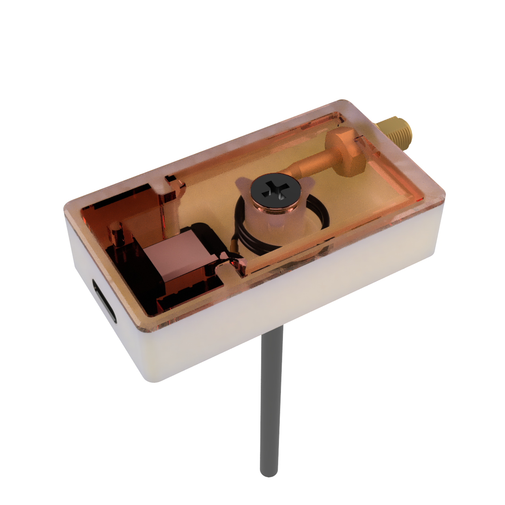

# MiTHBridge housing

## Housing for XIAO ESP32-C6 

Case contains 2 parts - top and bottom. Top fits tightly to bottom (if your 3d printer is not good enough). Whole case can be mounted to wall using self-tapping screw goint through the case. 

* Printables v1:
  * [Bottom](./xiao_esp32-c6_extant/3mf/MiTHBridge_xiao_esp32-c6_extant_case_bottom_v1.3mf)
  * [Top](./xiao_esp32-c6_extant/3mf/MiTHBridge_xiao_esp32-c6_extant_case_top_v1.3mf)
* 3D Model v1 (.STEP):
  * [.STEP](./xiao_esp32-c6_extant/MiTHBridge_xiao_esp32-c6_extant_case_v1.step)