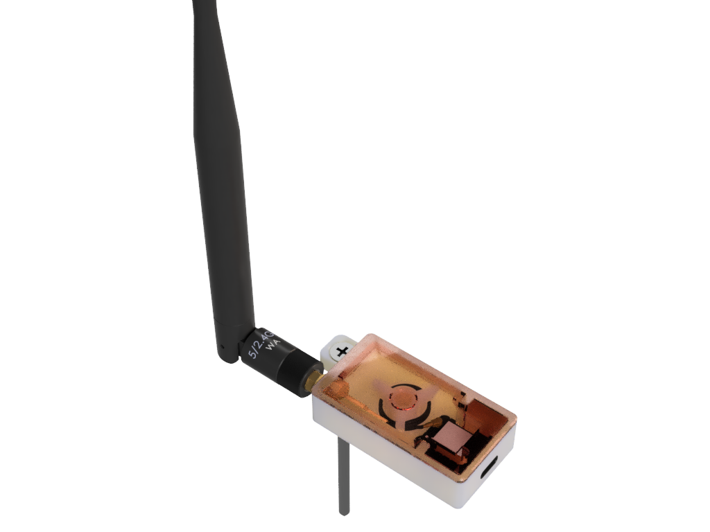

# MiTHBridge housing

## Housing for XIAO ESP32-C6 

Case contains 2 parts - top and bottom. Top fits tightly to bottom (if your 3d printer is not good enough). This is for 10cm IPEF-SMA pigtail cable.

* Version 1.1 (2025-09-29)
  * [.STEP](./xiao_esp32-c6_extant/MiTHBridge_xiao_esp32-c6_extant_case_v1.1.step)
  * [Bottom .3mf](./xiao_esp32-c6_extant/3mf/MiTHBridge_xiao_esp32-c6_extant_case_bottom_v1.1.3mf)
  * [Top .3mf](./xiao_esp32-c6_extant/3mf/MiTHBridge_xiao_esp32-c6_extant_case_top_v1.1.3mf)
  